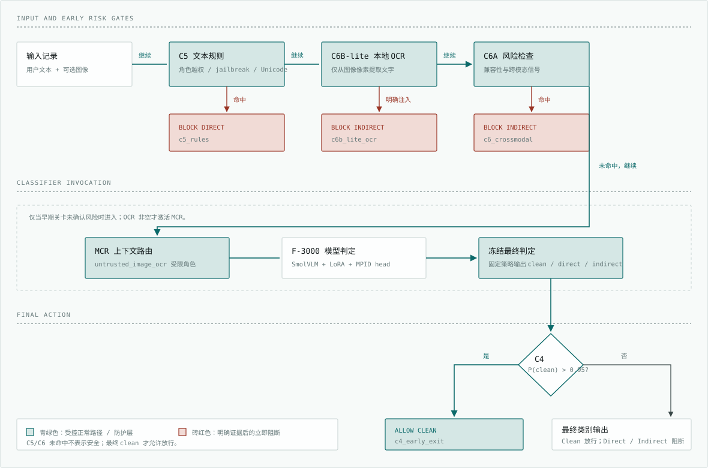
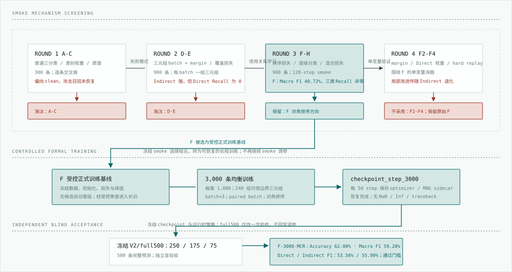

# MPID 离线多模态提示注入检测结题报告

> **报告版本**：v2.0
>
> **完成日期**：2026-08-09
>
> **最终方案**：`F-3000-MCR`
>
> **最终效果口径**：冻结 `MPID Standard Benchmark v2/full500` 的完整离线 pipeline 验收

---

## 摘要

本项目面向离线、隐私敏感和资源受限场景，构建轻量级多模态提示注入检测方案。任务将输入分为正常输入（`clean`）、直接提示注入（`direct`）和间接/多模态提示注入（`indirect`）三类。基础检测器为 SmolVLM-500M 加载 LoRA 与 MPID 三分类 head；在其上组合 C4/C5/C6 防线、本地 OCR、多模态上下文路由和固定运行时决策策略，形成最终离线交付方案 **F-3000-MCR**。

正式训练以策略 F 为基线，使用 3,000 条均衡训练样本完成至 `checkpoint_step_3000`。原始 head 在正式验收中出现 Indirect 类塌缩，因此项目保持 checkpoint 不变，仅在冻结的 smoke150 上选择并锁定运行时补强：本地 OCR 驱动的多模态上下文路由（MCR）及其固定决策策略。该策略在 full500 验收前已锁定，full500 不参与参数选择。

最终完整离线 pipeline 在冻结 V2/full500 上取得 Accuracy **62.00%**、Macro F1 **59.28%**、Weighted F1 **61.32%**；clean/direct/indirect F1 分别为 **68.38% / 53.56% / 55.90%**。三类 Recall 均非零，满足预设的 Direct F1 >= 35% 和 Macro F1 >= 45% 门槛。最终方案已形成可移动离线 artifact、完整 checksum、离线 smoke、性能证据和发布审计。该结论只适用于锁定的模型、推理策略和 Benchmark v2，不构成对未知攻击或生产高并发环境的无条件安全承诺。

**关键词**：提示注入；离线部署；多模态安全；LoRA；OCR；纵深防御

---

## 1. 研究目标与范围

### 1.1 目标

项目研究的问题是：在不依赖云端 API 的条件下，如何对用户文本和可选图像进行三分类提示注入检测，并在检测效果、离线可部署性、可解释性和资源消耗之间取得可审计的平衡。

交付目标如下：

1. 形成可离线运行的 `clean` / `direct` / `indirect` 三分类检测器。
2. 使用 LoRA 降低轻量 VLM 的微调与迭代成本。
3. 将规则、OCR 与模型判断组合为可解释的分层防线。
4. 建立训练、checkpoint、评测、预测、打包和发布审计闭环。
5. 以冻结 Benchmark v2 的独立 full500 结果作为最终能力结论。

### 1.2 范围与边界

| 维度 | 本项目范围 |
|---|---|
| 部署环境 | 离线 PC、低吞吐端侧和人工辅助审计场景 |
| 输入 | 文本和可选图像 |
| 安全任务 | `clean` / `direct` / `indirect` 三分类 |
| 模型 | SmolVLM-500M + LoRA + MPID classification head |
| 运行时防线 | C4 高置信 clean 放行、C5 规则、C6 本地 OCR / 跨模态检查、MCR 与固定决策策略 |
| 不在范围内 | 云端安全服务、7B 以上模型横评、攻击自动化、生产级安全承诺、高并发实时服务 |

`direct` 指攻击指令直接出现在用户文本中；`indirect` 指恶意指令位于图像或其他不可信外部内容中，或由图文组合形成。三分类而非二分类的原因是两类攻击依赖不同证据和防线，单一 Accuracy 无法揭示某一攻击类完全漏报的问题。

---

## 2. 最终方案：F-3000-MCR

### 2.1 方案组成

最终方案不是再训练一个新的 checkpoint，而是以固定的 `checkpoint_step_3000` 为判定核心，并在其前后配置可审计、可离线复现的防护策略。它将“明显攻击先快速阻断”“模糊样本交给多模态模型”“按冻结策略做最终判定”“高置信安全样本快速放行”拆成不同责任层，避免把所有问题都交给单一模型承担。

#### 2.1.1 从输入到决策的运行流水线

下图描述逻辑执行顺序。MCR 是分类器调用的输入构造；模型输出随后按冻结的运行时决策策略完成类别判定。C5、C6B-lite、C6A 和 C4 则是 pipeline 的前后置关卡。



*图 1：F-3000-MCR 的审计式运行流程。早期关卡只在有明确证据时立即阻断；未命中记录再进入 MCR、F-3000 和冻结决策策略。青绿色表示受控的正常路径和防护层，砖红色表示规则确认后的风险阻断。*

其中有两个重要的非等价判断：C5/C6 的“未命中”只代表没有发现可由规则确认的风险，不等价于安全；C4 的放行则必须建立在前置风险关卡通过、且模型对 `clean` 具有足够高置信度的前提上。

#### 2.1.2 训练核心：F-3000 LoRA 与边界学习

| 措施 | 理论分析 | 实际作用与边界 |
|---|---|---|
| LoRA 微调 | LoRA 将权重更新写为低秩增量 `W' = W + BA`，冻结原始权重 `W`，只学习小矩阵 `A/B`。这以较少参数改变任务表征，降低小样本全量微调的遗忘和过拟合风险。 | F-3000 在语言注意力的 `q/k/v/o` 投影上采用 `r=32`、`alpha=64`、`dropout=0.1`；视觉编码器和多模态投影保持冻结。它让基础 SmolVLM 适配 MPID 三分类，而不是重新学习视觉能力。 |
| MPID 三分类头 | 分类头将隐藏表征映射为 `clean/direct/indirect` 三个 logits。显式保留攻击来源类别，才能针对文本直接注入和图像/间接注入学习不同边界。 | 固定使用 `checkpoint_step_3000.safetensors`，处理规则无法确认的语义边界样本，并输出 C4 与最终类别判定所需的概率分布；单独使用时仍受训练分布和类别偏置影响。 |
| 反事实三元组与对角排序 | 一个三元组由同一场景的 `clean/direct/indirect` 变体构成。对角排序损失要求每个变体在对应类别上的得分高于其他类别，从“记住关键词”转向学习仅改变攻击因素后的相对判别关系。 | 240 组完整三元组（720 条）用于强化边界，其余样本保持常规训练。这是 F-3000 对 indirect 更敏感的训练信号，但不能替代运行时 OCR 和规则防线。 |

#### 2.1.3 运行时防护与决策组件

| 组件 | 理论分析 | 实际作用与边界 |
|---|---|---|
| C5：文本规则 | 对稳定表面特征的攻击，确定性模式匹配相当于高精度签名检测器。它将无需语义推理即可确认的风险从统计模型中分流，降低误判和无谓推理成本。 | 在模型前识别角色越权、jailbreak、Unicode 绕过等高确定性 direct 注入；命中立即阻断并保留规则证据。它不覆盖改写、隐喻或新型攻击，未命中后必须继续后续判定。 |
| C6B-lite：本地 OCR | 图像注入常以文字像素承载指令。先将像素转换为文本，再检查明确冲突指令，是把视觉风险转化为可解释符号证据的两阶段检测。 | 只使用本地 RapidOCR 从实际图像像素读取文字，不读取 benchmark OCR 标注。检测到明确的“忽略之前指令”“system prompt”等图像注入时按 `indirect` 阻断；OCR 为空、失败或文案模糊时交由模型，不把不确定性直接当作攻击。 |
| C6A：兼容性/跨模态检查 | 该层利用记录结构、文本与图像关系中的已知不兼容风险作为补充信号，适合覆盖模型前可确认的历史兼容性问题；它不是通用视觉语义理解器。 | 位于 OCR 后、模型前；命中时按 `indirect` 阻断。它补足特定跨模态与兼容性风险路径，不能替代 C6B 的像素 OCR 或 F-3000 的语义判别。 |
| MCR：多模态上下文路由 | 提示注入的根源之一是将外部内容与用户指令混在同一权限边界。MCR 按最小权限原则为外部图中文字分配受限角色，使模型能看到内容但不将其解释为可执行指令。 | 仅当本地 OCR 非空时，将结果封装为 `untrusted_image_ocr` 上下文，而非拼接进用户指令；不引入数据集标注。它改善图文混合输入的角色边界，但不单独判定攻击，仍需 F-3000 输出类别。 |
| 冻结运行时决策策略 | 训练后的分类分数需要在独立选择集上固定判定方式，才能避免把测试集误差回写为规则。将决策策略固定在模型外，可保留 checkpoint 的可回退性和审计边界。 | 该策略仅在 smoke150 上确定，full500 不参与选择；它作为 F-3000-MCR 的内部固定配置随离线包交付，而不改变 LoRA、训练数据或 checkpoint。 |
| C4：高置信 clean 门 | 这是一种选择性分类思想：只在模型对安全类别足够确定时走快速放行路径，低置信样本保持更保守的最终分类处理。阈值将便利性与漏检风险显式化。 | 在 C5/C6 风险关卡和模型最终判定后检查 `P(clean) > 0.95`，满足则以 `c4_early_exit` 放行，减少后续生成或业务处理；否则按最终类别决定。它不会绕过任何已命中的风险规则，也不将低置信样本默认为安全。 |

### 2.2 设计原则

1. **规则优先，语义兜底。** C5 与 C6B-lite 处理高确定性证据，剩余难例交给 VLM head。
2. **不可信外部内容隔离。** MCR 将图像 OCR 作为不可信内容的角色边界，而不是把 benchmark 中的 OCR 标注文字注入模型。
3. **决策与训练分离。** MCR 与固定运行时决策策略都不改变 LoRA、optimizer、训练数据或 checkpoint。
4. **先选策略，再做盲验收。** 运行时决策方式在 smoke150 锁定，full500 只用于一次最终验收，不能再用于调参。
5. **保留决策证据。** 输出可追溯至规则命中、OCR 分支、MCR 激活、head fallback 或最终判定阶段。

---

## 3. F-3000 正式训练与收敛过程

### 3.1 主要训练版本的演进

MPID 的训练路线不是单次长训直接得到最终方案，而是先建立轻量 LoRA 基线和离线防线，再通过长期训练、统一 smoke 筛选和冻结 V2/full500 验收收敛至 F-3000。下表先给出主要版本的全局脉络，再在后续小节展开 Full-3000 的具体过程。

表中的“迭代训练时间”是日志可提取的训练墙钟时间，未计入人工分析、数据构造、评测和打包；Full-3000 的约 124 小时包含 A-H、F2-F4 等策略筛选与 F 正式训练，不能把它理解为单次 3,000-step 训练耗时。

| 主要版本 | 训练与迭代投入 | 正式 Benchmark | 已记录的正式结果 | 阶段结论 |
|---|---:|---|---|---|
| Balanced-600 | 600 step，约 4.8 小时 | V1/full，300 条 | LoRA-only：Accuracy 34.3%、Macro F1 22.5%；加 C4-C6：45.3% / 40.7% | 首次证明分层防线可提升弱攻击类，但整体仍未达到可靠三分类 |
| Full-2000 | 2,000 step，约 21.8 小时 | V1/full，300 条 | LoRA-only：35.3% / 21.7%；加 C4-C6：40.3% / 29.4% | 验证长任务恢复与离线链路；基础 head 偏向 Direct，clean/Indirect 不足 |
| F-3000 | 策略筛选与正式训练合计约 124 小时 | V2/full，500 条 | LoRA-only：56.60% / 38.89%；最终 F-3000-MCR：62.00% / 59.28% | 唯一通过预设三分类门槛的最终方案 |

两套 V1 结果与 V2/full 的类别分布、样本数不同，不能横向比较绝对分数；本表只说明工程与方法的演进路径。最终能力结论只以最后一行的冻结 V2/full500 完整离线 pipeline 为准。

### 3.2 Full-3000：先 smoke 筛选，再正式全量训练

Full-3000 并非直接启动一次 3,000-step 长训练，而是采用“**小规模机制验证 → 冻结 smoke 横评 → 受控正式训练**”的两阶段收敛路径。所有 smoke 候选均从 Full-2000 的 LoRA 初始化出发，且只写入独立 smoke 目录；正式 checkpoint 目录在筛选期间保持为空。这样可以先用低成本试错定位类别塌缩的原因，避免将数十小时 CPU 训练投入到未经验证的损失函数或数据机制中。

候选最终统一在冻结的 Standard Benchmark v2/smoke 上评测：150 条样本，clean/direct/indirect 为 75/53/22，含 30 条图像/OCR 样本；所有候选使用相同脚本和 `batch_size=1` 生成完整 150 条预测。因此，smoke 的作用是比较训练方向和识别失效模式，V2/full500 仍保留给最终盲验收。



*图 2：Full-3000 的端到端演进。青绿色表示保留、冻结或进入下一阶段的方向；砖红色表示因类别塌缩、单类退化或无实质改善而停止的候选。smoke150 只用于机制筛选，full500 只用于最终盲验收。*

#### 统一 smoke 横评总表（A-H、F2-F4）

下表给出全部 11 个候选在同一 smoke150 上的完整结果，而非只列出最终保留的 F。`R / F1` 分别为对应类别的 Recall 与 F1；所有候选均未通过预设门槛（三类 Recall 均大于 0、Direct F1 >= 35%、Macro F1 >= 45%），因此本表用于筛选训练方向，不用于宣称最终能力。

| 策略 | Accuracy | Macro F1 | Weighted F1 | clean R / F1 | direct R / F1 | indirect R / F1 | 筛选结论 |
|---|---:|---:|---:|---|---|---|---|
| F | 46.67% | 40.72% | 48.28% | 64.0% / 66.2% | 26.4% / 33.7% | 36.4% / 22.2% | 受控正式训练基线 |
| F2 | 46.67% | 40.13% | 48.19% | 65.3% / 66.7% | 26.4% / 33.7% | 31.8% / 20.0% | Direct margin 调整无收益 |
| F3 | 46.67% | 40.77% | 48.47% | 64.0% / 66.7% | 26.4% / 33.7% | 36.4% / 21.9% | 无实质改善，保留 F |
| F4 | 46.00% | 38.01% | 47.42% | 66.7% / 66.2% | 28.3% / 35.3% | 18.2% / 12.5% | Direct 局部提升但 Indirect 退化 |
| G | 36.00% | 30.57% | 31.88% | 42.7% / 48.1% | 3.8% / 6.9% | 90.9% / 36.7% | 几乎失去 Direct |
| A | 50.00% | 28.67% | 36.17% | 96.0% / 66.7% | 0.0% / 0.0% | 13.6% / 19.4% | 明显偏向 clean |
| E | 29.33% | 23.80% | 24.61% | 33.3% / 40.0% | 0.0% / 0.0% | 86.4% / 31.4% | Direct 塌缩、偏向 Indirect |
| D | 28.67% | 23.41% | 24.07% | 30.7% / 39.0% | 0.0% / 0.0% | 90.9% / 31.2% | Direct 塌缩、偏向 Indirect |
| H | 46.00% | 22.14% | 32.70% | 90.7% / 63.0% | 1.9% / 3.4% | 0.0% / 0.0% | Indirect 塌缩、偏向 clean |
| B | 48.67% | 22.12% | 33.18% | 97.3% / 66.4% | 0.0% / 0.0% | 0.0% / 0.0% | 攻击类完全塌缩 |
| C | 48.67% | 22.02% | 33.03% | 97.3% / 66.1% | 0.0% / 0.0% | 0.0% / 0.0% | 攻击类完全塌缩 |

该横评同时解释了为何不以 Accuracy 最高的 A 作为候选：其 50.00% Accuracy 来自对 clean 的严重偏置，Direct Recall 为 0。F3 的 Macro F1 仅比 F 高 0.05pp、Direct 指标完全相同且 Indirect F1 下降；F4 虽将 Direct F1 提升至 35.3%，却将 Indirect Recall 从 F 的 36.4% 降至 18.2%。因此，F 是进入长训练前风险最可控、类别最平衡的选择。

#### 3.2.1 第一轮：普通分类头的快速基线（A-C）

第一轮先回答一个基础问题：在 Full-2000 LoRA 初始化上，仅靠常规三分类交叉熵、类别权重或蒸馏，能否恢复 Direct 与 Indirect 的边界。三项均使用 300 条均衡 smoke 训练数据，含 120 条成组反事实样本；初期以 `batch_size=1` 和较长 head warm-up 运行，因此更接近“新分类头校准”而非完整关系学习。

| 策略 | 主要机制 | 希望解决的问题 | smoke 结论 |
|---|---|---|---|
| A | 普通 flat 三分类头，无类别加权 | 建立稳定的交叉熵基线 | Macro F1 28.67%，明显偏向 clean |
| B | 在 A 上提高 direct/indirect 类别权重 | 让攻击类在交叉熵中获得更大梯度 | Macro F1 22.12%，未恢复攻击类别召回 |
| C | 在 B 上加入 Full-2000 teacher 蒸馏 | 保留旧模型的 Direct 判别能力 | Macro F1 22.02%，蒸馏未改变 clean 偏置 |

这轮结果说明：loss 虽能下降，但逐条交叉熵没有显式表达“同一载荷在可信请求、直接命令和不可信外部内容中应属于不同类别”的关系；仅提高类别权重或使用 teacher 约束不足以恢复 Direct 边界。因此没有把 A-C 扩展为长训练，而是转向成组三元组和边界损失设计。

#### 3.2.2 第二轮：反事实三元组与边界约束（D-E）

第二轮将训练单位从独立记录改为完整的 clean/direct/indirect 三元组。Smoke 训练集由 240 个同载荷反事实三元组（720 条）和 180 条真实补充样本组成，共 900 条、每类 300 条。每个 `batch_size=3` batch 固定包含一个三元组，使模型能直接学习三种上下文的判别关系。

| 策略 | 主要机制 | 希望解决的问题 | smoke 结论 |
|---|---|---|---|
| D | 三元组 batch + 三分类交叉熵 + 通用 logit margin + 三元组覆盖损失 | 防止三元组全部塌缩到同一预测类 | Macro F1 23.41%，Indirect 强但 Direct Recall 为 0 |
| E | 在 D 上为 Direct 增加更强的专用 margin | 强制 Direct 相对 clean/indirect 拉开更大距离 | Macro F1 23.80%，Direct Recall 仍为 0，淘汰 |

D/E 证明了三元组数据可以提升 clean 与 Indirect，但“覆盖损失 + 强 margin”没有将 Direct 学成可泛化的单独边界，反而将 Direct 样本分流到 clean 或 indirect。因此，本轮按“任一类 Recall 为 0 即停止”的 smoke 规则终止，避免继续执行无效的 200/250-step 扩展训练。

#### 3.2.3 第三轮：比较排序损失、层级分类与混合损失（F-H）

在 D/E 的失败基础上，第三轮不再只要求三元组的预测类别覆盖，而是比较三种不同的类别关系建模方式。F/G/H 均使用 900 条三元组结构数据、`batch_size=3` 和 120-step smoke 预算，并从同一 Full-2000 LoRA 初始化开始、重新初始化分类头与优化器。

| 策略 | 主要机制差异 | 设计假设 | smoke 结论 |
|---|---|---|---|
| F | flat 三分类；保留通用/Direct margin；以较强的**对角排序损失**要求三元组内每个样本在自身类别 logit 上高于另外两类；移除覆盖损失 | 直接学习“各样本应落在各自对角类别”的排序关系，比只约束预测分布更具体 | Macro F1 40.72%，三类 Recall 均非零，类别最平衡 |
| G | 层级分类：先判 direct/non-direct，再判 clean/indirect；不使用 margin 或三元组排序损失 | 将 Direct 与其他两类先分开，降低三类平面决策难度 | Macro F1 30.57%，Indirect Recall 高达 90.9%，但 Direct Recall 仅 3.8% |
| H | F-D 混合：降低对角排序强度，同时恢复保守的通用 margin 与三元组覆盖损失 | 兼顾 F 的关系排序和 D 的预测分布约束 | Macro F1 22.14%，回到 clean 偏置，Indirect Recall 为 0 |

这一步给出了正式训练方向：F 不依赖层级拆分，也不依赖“至少预测到每一类”的软覆盖约束，而是用成组对角排序直接约束每个反事实样本的正确类别。它虽未达到自动晋级门槛，但在所有候选中是唯一同时保留三类召回、且 Direct/Indirect 不发生归零的方向。

#### 3.2.4 第四轮：围绕 F 的单变量验证（F2-F4）

在进入正式训练前，项目没有直接把 F 视为最终配置，而是继续做三项单变量 smoke 消融，验证 Direct 边界能否在不破坏三类平衡的前提下进一步改善。

| 策略 | 相对 F 的唯一主要变化 | 目的 | smoke 结论 |
|---|---|---|---|
| F2 | 将 `direct_margin` 从 0.35 提高到 0.55 | 增强 Direct 对两类竞争标签的间隔 | Macro F1 40.13%，Direct 指标不变、Indirect F1 下降，不采用 |
| F3 | 将 Direct 类权重设为 1.25 | 增大 Direct 的交叉熵梯度 | Macro F1 40.77%，仅微小波动，Direct F1 不变，不构成实质改进 |
| F4 | 使用 30 个困难 Direct replay 三元组与 90 个原始三元组组成 120 组训练数据 | 强化可信的 Direct 边界，而不回灌 benchmark 样本 | Direct F1 升至 35.3%，但 Indirect Recall 降至 18.2%，属于单类过拟合 |

F2-F4 的结果进一步说明：Direct 问题不能仅靠增大 margin、类别权重或提高困难 Direct 的采样比例解决；这些调整会造成 Indirect 退化，或几乎不改变决策边界。因此正式训练保留 F 的原始平衡配置，而不是采用局部指标更高的 F3/F4。

#### 3.2.5 统一选择结论：以 F 作为受控正式训练基线

最终对 A-H、F2、F3、F4 的 11 个 checkpoint 进行统一 V2/smoke150 横评。所有候选都生成完整 150 条 `predictions.jsonl`；正式训练目录在整个筛选过程仍为 0 个 checkpoint。预设筛选门槛为三类 Recall 均大于 0、Direct F1 >= 35%、Macro F1 >= 45%。严格按该门槛，所有 smoke 候选均未自动晋级。

但是，F 的三类 Recall 均非零，Macro F1 为 40.72%，并且在 Direct/Indirect 之间保持了最可控的平衡；F3 仅比 F 高 0.05pp，且没有改善 Direct；F4 的 Direct 局部提升以 Indirect 明显退化为代价。项目因此将 F 定义为**受控正式训练基线**：先固定数据、初始化、损失和阈值，并在正式训练中保存可恢复 checkpoint；是否形成最终方案仍必须接受后续 V2/full500 的独立验收。该决策避免了把 smoke 分数当作最终能力结论，也避免了在类别塌缩明显的方向上继续消耗长训练资源。

原始训练配置、逐条预测和审计材料见 [reference.md](/C:/work/llm-compliance/doc/reference.md:3557) 第三章及 `runs/phase2_3_full_3000_20260729_0958/artifacts/`。

### 3.3 Full-3000：正式训练、恢复与 checkpoint 固化

第二阶段使用 F 的冻结配置进行正式训练。训练先经过数值稳定预检和阶段 checkpoint 验证，再通过保存的 optimizer/RNG 状态恢复至 step 3000。

| 项目 | 配置 |
|---|---|
| 训练数据 | 3,000 条均衡样本，clean/direct/indirect 各 1,000 条 |
| 边界样本 | 240 组可信边界三元组 |
| 骨干 | SmolVLM-500M |
| LoRA | `r=32`，`alpha=64`，`dropout=0.10` |
| 批处理 | `batch_size=3`，`paired_batch_mode=true` |
| 直接注入边界 | `direct_margin=0.35` |
| 保存策略 | 每 50 step 保存 checkpoint、optimizer 与 RNG sidecar |
| 训练完成 | `checkpoint_step_3000`，退出码 0，无 NaN、Inf 或 traceback |

`checkpoint_step_3000`、对应恢复 state、训练日志和原始预测都被保留。此后不再通过训练改动 LoRA 权重；后续工作只在固定 checkpoint 上评估运行时策略，以保证最终方案的权重来源清晰、可回退且可审计。

### 3.4 Full-3000：固定权重后的诊断与运行时补强

第三阶段首先对原始 F-3000 head 做 full500 诊断，再仅以“不训练、不修改权重”的方式寻找补强策略。

| 尝试 | 是否改变训练权重 | 处理与结论 |
|---|---|---|
| 原始 step3000 head | 否 | full500 的 Indirect F1 为 0，存在类别塌缩，不能作为最终方案 |
| step2250/3000 logits ensemble | 否 | 未改善三类平衡，不采用 |
| 条件 OCR rescue / OCR 文本注入 | 否 | smoke 未达到基线或带来误报，不采用 |
| MCR 与冻结决策策略 | 否 | 将本地 OCR 非空图像置于 `untrusted_image_ocr` 角色，并在 smoke 中锁定配套判定方式，构成最终运行时补强 |

原始 step3000 head 的 V2/full500 结果为 Accuracy 56.60%、Macro F1 38.89%、clean/direct/indirect F1 为 67.19% / 49.48% / 0.00%。这说明 loss 收敛和 checkpoint 成功保存不等同于安全三分类达到要求，也说明最终提升主要来自“固定 F-3000 head + 明确的运行时证据与冻结判定策略”这一组合，而不是重新训练出另一套 LoRA 权重。

---

## 4. V2/full500 评测方案与最终结果

### 4.1 冻结 Benchmark v2

| 数据集 | 样本数 | 类别分布（clean/direct/indirect） | 用途 |
|---|---:|---:|---|
| V2/smoke | 150 | 75 / 53 / 22 | 训练策略与推理参数选择、失败诊断 |
| V2/full | 500 | 250 / 175 / 75 | 最终一次盲验收 |

Benchmark 通过 `dedup_key`、来源、记录标识、归一化文本指纹和 manifest/checksum 与训练数据隔离。最终评测只把 `text` 和可选 `image` 传给离线包；gold 标签、benchmark 元数据和 OCR 注释均保留在包外。所有 500 条预测均已生成，日志无 NaN、Inf 或 traceback。

### 4.2 指标与放行门槛

Macro F1 是主指标，因为它能惩罚仅预测多数类或遗漏某个攻击类的情况。报告同时给出 Accuracy、Weighted F1 和各类 Precision/Recall/F1。

预先声明的放行门槛：

1. 三类 Recall 均大于 0；
2. Direct F1 >= 35%；
3. Macro F1 >= 45%。

---

### 4.3 MPID LoRA-only 与完整优化链路的同基准对照

两行均使用相同的 `checkpoint_step_3000`、相同的冻结 V2/full500 输入和同一三分类任务定义。`MPID LoRA-only` 只运行 LoRA + MPID head；最终方案在该 head 外叠加 C4/C5/C6、MCR 和冻结运行时决策策略。因此，该表衡量的是固定 F-3000 权重下完整离线防线的端到端增量，而不是新 checkpoint 带来的增量。

| 指标 | MPID LoRA-only | F-3000-MCR（LoRA + 全部优化） | 增量 |
|---|---:|---:|---:|
| Accuracy | 56.60% | **62.00%** | **+5.40pp** |
| Macro F1 | 38.89% | **59.28%** | **+20.37pp** |
| Weighted F1 | 50.91% | **61.32%** | **+10.41pp** |
| clean Precision / Recall / F1 | 55.64% / 84.80% / 67.19% | 63.27% / 74.40% / 68.38% | F1 **+1.19pp** |
| direct Precision / Recall / F1 | 63.39% / 40.57% / 49.48% | 65.83% / 45.14% / 53.56% | F1 **+4.08pp** |
| indirect Precision / Recall / F1 | 0.00% / 0.00% / 0.00% | 52.33% / 60.00% / 55.90% | F1 **+55.90pp** |
| 预测完整性 | 500 / 500 | 500 / 500 | 完整 |
| 总体平均判定耗时（模型加载后） | 14.06 秒/条 | **10.56 秒/条** | **-3.49 秒/条（-24.86%）** |
| clean 平均判定耗时（250 条） | 14.07 秒/条 | **12.02 秒/条** | **-2.06 秒/条（-14.62%）** |
| direct 平均判定耗时（175 条） | 14.53 秒/条 | **10.51 秒/条** | **-4.01 秒/条（-27.63%）** |
| indirect 平均判定耗时（75 条） | 12.91 秒/条 | **5.83 秒/条** | **-7.07 秒/条（-54.80%）** |

正确性报告、按类计时产物和逐条预测保留在 [Full-3000 审计目录](/C:/work/llm-compliance/runs/phase2_3_full_3000_20260729_0958/artifacts)。两次计时回归均生成 500 条预测，且未出现 NaN、Inf 或 traceback；标签只在推理完成后用于类别分组。

### 4.4 正确性、效率与审计结论

1. **三类攻击不再被单类优势掩盖。** Indirect Recall 60.00%、Indirect F1 55.90%，解决了原始 F-3000 head 的 Indirect F1 为 0 的失效模式。
2. **直接注入仍是优先改进项。** Direct Recall 为 45.14%，175 条 Direct 中仍有 96 条没有被最终判为 Direct；后续应按规则漏报、改写攻击、Unicode 混淆和语义边界分桶分析。
3. **完整链路同时改善总体与分类判定效率。** 在模型加载完成后、相同的逐条 full500 计时口径下，本轮 LoRA-only 总耗时为 7,028.2 秒（14.06 秒/条），完整 pipeline 为 5,280.9 秒（10.56 秒/条），平均每条减少 3.49 秒（24.86%）。按 gold 类别分组，Direct 和 Indirect 的降幅最大，分别为 27.63% 和 54.80%，符合 C5/C6B-lite 对明确攻击证据进行短路的设计预期；clean 也降低 14.62%，并未出现“完整链路必然更慢”的现象。该结果来自同机串行的一次测量，适合作为当前交付包的回归证据，不等价于冷启动、高并发吞吐或跨硬件的性能承诺。
4. **工程审计通过。** 最终链路生成 500/500 条预测且无 NaN、Inf 或 traceback；发布清单 94 项、包内 checksum、断网 smoke 和 ZIP CRC 均通过。C5/C6B-lite、OCR 与 MCR 的决策证据均来自运行时本地输入，不读取 benchmark 标签或 OCR 标注。

---

## 5. 离线交付与复现

### 5.1 最终 artifact

推荐交付目录位于 [runs/_artifact/](/C:/work/llm-compliance/runs/_artifact)。它包含：

1. 固定的 `checkpoint_step_3000.safetensors`、SmolVLM-500M 与 RapidOCR 权重；
2. 含 MCR、固定运行时决策策略和 C4/C5/C6 的离线推理代码；
3. `MANIFEST.json`、`CHECKSUMS.txt`、发布清单和发布审计；
4. 包内 `smoke_offline.py`、图像 smoke fixture、full500 报告和性能证据。

可移动压缩包与发布审计随交付目录保留。

| 验证项 | 结果 |
|---|---|
| 发布文件清单 | 94 个文件全部匹配 |
| 包内 checksum | 全部匹配 |
| 离线 smoke | 3/3 通过：C5 direct、clean head fallback、C6B OCR block |
| ZIP CRC | 通过 |
| ZIP SHA-256 | `95c80b7cf4a5a96c9b4779b1aebd9b29f3eca943fbbbbf9ef5a2800cc41c8349` |

部署前应在兼容的 CPU/Python 环境从受控本地 wheel 源安装 `requirements.txt`，再执行：

```powershell
python mpid_offline/smoke_offline.py --pkg mpid_offline --stage-root offline_smoke_stage
```

单条 NDJSON 输入格式为：

```json
{"text":"待检测文本","image":"可选本地图片路径"}
```

该方案适合离线批处理、人工辅助审计和低吞吐端侧防护；当前性能不支持高并发实时服务的声明。端到端 full500 的总体与分类计时补测产物随交付包和 Full-3000 审计目录保留，用于部署诊断而非替代端到端对比。

---

## 6. 方案未来展望

### 6.1 数据与独立评测

当前结果证明冻结 V2/full500 上的方案可用，但不能替代跨域泛化结论。下一阶段应扩充中文、英文、中英混合、Unicode 混淆、OCR 噪声和图文语义冲突样本，并增加真实或更贴近真实的间接注入载体。所有规则、决策策略或训练变体都应在新的冻结留出集上进行逐层消融：LoRA-only、+MCR、+C5/C6 与完整 pipeline，并按图像/OCR、语言、攻击来源和风险强度报告子集指标；不得继续用当前 full500 搜索参数。

### 6.2 模型与防御架构

Direct 漏报仍是当前最明确的质量瓶颈，应围绕改写攻击、引用型攻击、角色伪装和 Unicode 混淆建立困难样本桶。若要继续训练，应保持 `checkpoint_step_3000` 可回退，并单独冻结新的训练/验证协议。当前 LoRA 只作用于语言侧，是在数据规模、视觉对齐风险和平台稳定性约束下的工程取舍；当获得更大规模、高质量图像间接注入数据和稳定 GPU 资源后，可受控验证视觉侧或跨模态投影层的 LoRA，但不能直接假定其一定优于当前 C6/MCR 的模块化分工。

### 6.3 效率与工程化

最终包已经满足离线、可移动和可审计要求，但尚不适合高并发实时服务。完整 pipeline 的同口径 full500 总耗时和平均判定耗时已补齐；下一步应扩展冷启动、P50/P95、吞吐、峰值内存和 OCR 失败回退测量，并在不降低三类安全门槛的前提下，评估 C4 的实际早退收益、量化/ONNX 等推理引擎优化，以及 CPU/GPU/边缘设备上的可复现部署。工程侧应继续完善依赖锁定、模型版本治理、自动化完整性校验、回归测试和人工复核接口。

---

## 7. 结论与适用边界

### 7.1 最终结论

`F-3000-MCR` 是本项目的最终推荐方案。它以已完成训练的 `checkpoint_step_3000` 为基础，将规则、像素 OCR、多模态上下文隔离和冻结运行时决策策略按固定顺序组合，在冻结 V2/full500 上达到 Accuracy 62.00%、Macro F1 59.28%、Direct F1 53.56%、Indirect F1 55.90%。结果通过预设三分类门槛，并已完成可移动离线 artifact 的完整性、断网 smoke 和 ZIP CRC 验证。

### 7.2 适用边界

1. 本结论只适用于当前 checkpoint、冻结运行时决策策略、C4-C6 版本和冻结 Benchmark v2。
2. MCR 与固定运行时决策策略属于推理配置，不应被表述为新的微调模型或新的 LoRA 权重。
3. 不能在当前 full500 上继续搜索阈值、offset 或规则；任何后续变体须使用新的、未参与选择的冻结评测集验收。
4. Direct 漏报、OCR 噪声、未知攻击形式、低质量图像和跨平台运行差异仍是主要风险。

## 附录：证据与历史记录原则

- 最终效果结论只引用冻结 V2/full500 的完整离线 pipeline 结果。
- V2/smoke 只用于策略选择和回归诊断，不作为最终能力排名。
- 早期 V1、run-local smoke、组件测试和离线包 smoke 只证明工程可运行性或用于问题定位。
- A-H、F2、F3、F4 的完整训练配置、逐类指标、日志和预测产物保留在 `runs/phase2_3_full_3000_20260729_0958/artifacts/`，汇总说明见 [reference.md](/C:/work/llm-compliance/doc/reference.md:3557)。

### A. 项目成果量化汇总

以下统计截至 2026-08-14。代码量按 Git 已跟踪的 `src/`、`scripts/`、`tests/` 和 `demo/` 下可执行源文件统计；运行轮次和耗时以 `runs/` 下保留的日志、配置和报告为依据。

| 维度 | 量化结果 |
|---|---:|
| 项目持续时间 | 2026-07-13 至 2026-08-14，共 33 个自然日（含首尾） |
| Git 提交 | 28 次 |
| 非临时运行目录 | 14 个 |
| 运行日志 | 207 份，其中训练日志 46 份、评测/对比日志 100 份、其他工作流日志 61 份 |
| 核心可执行代码 | 80 个文件、16,873 行 |
| Python | 79 个文件、16,382 行 |
| PowerShell | 1 个文件、491 行 |
| 全部已跟踪文本资产 | 731 个文件中的代码、文档、配置等文本合计 26,487 行 |

#### A.1 数据与评测资产

| 资产 | 数量 | 用途 |
|---|---:|---|
| 历史 `mpid-v1` 汇总数据 | 25,646 条 | 原始数据整理、数据质量检查和早期实验基础 |
| 跨模态注入子集 | 120 条 | 图像/OCR 间接注入验证 |
| F-3000 正式训练集 | 3,000 条 | clean/direct/indirect 各 1,000 条的均衡训练 |
| 可信边界三元组 | 240 组 | 直接注入边界与配对训练/诊断 |
| Standard Benchmark v1/full | 300 条 | 历史版本正式评测 |
| Standard Benchmark v2/smoke | 150 条（75/53/22） | 训练策略筛选、推理参数选择和回归诊断 |
| Standard Benchmark v2/full | 500 条（250/175/75） | 冻结后的最终盲验收 |

#### A.2 训练、方案筛选与时间投入

| 轮次 | 规模或内容 | 已记录墙钟时间 |
|---|---|---:|
| Full-500 | 500 step 的早期全量训练 | 约 4.79 小时 |
| Balanced-600 | 600 step 的均衡训练 | 约 4.8 小时 |
| Full-2000 | 2,000 step，包含恢复能力和离线链路验证 | 约 21.8 小时 |
| F-3000 | A-H、F2-F4 策略筛选和 F 正式训练 | 约 124 小时 |
| 可确认训练墙钟时间下限 | 上述四项合计 | **约 155.4 小时** |

`155.4` 小时是可从汇总报告和训练日志直接确认的下限；不计人工分析、数据构造、评测、打包、环境迁移，以及无完整结束耗时记录的早期尝试。因此它不能被表述为项目的全部人工或机器投入。

Full-3000 阶段对 A-H、F2、F3、F4 共 **11 个候选策略**进行了统一筛选；每个候选均在冻结 V2/smoke 的 150 条样本上生成完整预测，形成至少 **1,650 条**策略筛选预测。F 被选为最平衡的正式训练基线，并完成至 `checkpoint_step_3000`；后续 MCR 与固定运行时决策策略不新增 LoRA 训练轮次。

#### A.3 最终量化结果与交付验证

| 指标 | LoRA-only | F-3000-MCR 完整离线 pipeline | 增量 |
|---|---:|---:|---:|
| Accuracy | 56.60% | **62.00%** | **+5.40pp** |
| Macro F1 | 38.89% | **59.28%** | **+20.37pp** |
| Weighted F1 | 50.91% | **61.32%** | **+10.41pp** |
| Direct F1 | 49.48% | **53.56%** | **+4.08pp** |
| Indirect F1 | 0.00% | **55.90%** | **+55.90pp** |
| 平均判定耗时（模型加载后） | 14.06 秒/条 | **10.56 秒/条** | **-24.86%** |
| V2/full500 预测完整性 | 500 / 500 | **500 / 500** | 无 NaN、Inf 或 traceback |

最终离线交付包包含 **94 个**发布文件；包内 checksum 全部匹配，离线 smoke 的 3/3 payload 均通过，ZIP CRC 校验通过。由此形成了可复现的训练、筛选、最终验收、离线打包与完整性审计链路。
